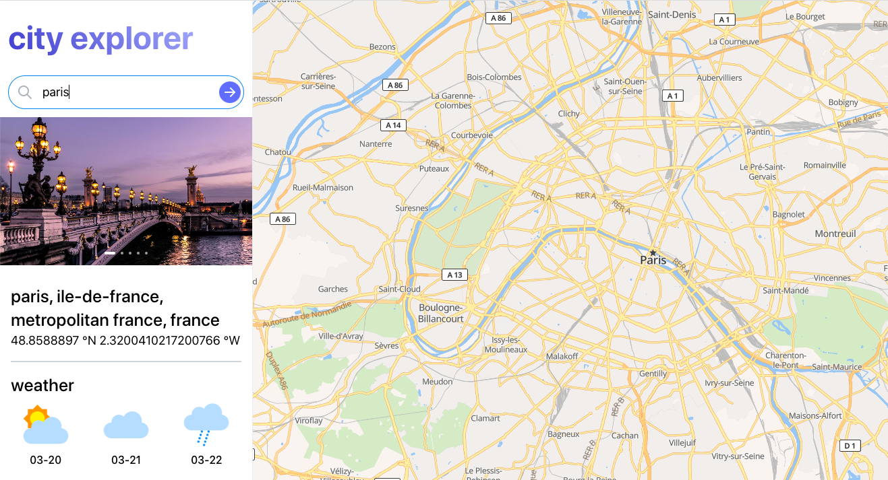
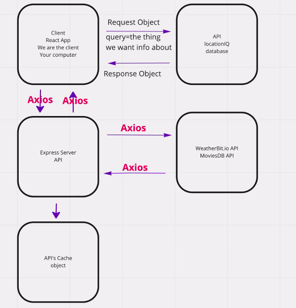

# City Explorer

**Author**: Camilla Rees
**Version**: 1.0.0

## [Click here to watch demo!](https://www.youtube.com/watch?v=KzTGJyqmIwU)

## Overview
Search any city in the world. Navigate a map of the city, its coordinates, a current 6 day forecast, and photos of the city! 

## How it Works

 In order to achieve the output listed in the overview above, this application utilizes a form to collect city name searches from the user, queries 4 APIs using form search input to pull location, weather, photo and map data. Mantine UI Components, including AppShell and NavBar were integrated to display key features. Error handlers are also built in to recognize API call errors and render a React Alert component with a respective error message.

## Key Features

### Map
- User can view a map of the city searched, explore any street from any angle, and navigate a map of the entire world in seconds. 

### Weather
- User can view the coordinates and 6 day forecast for city searched.

### Photos
- User can view relevant photos of the city searched.

### Server Memory
- Application stores previous searches in server memory for future calls, rather than incurring the delay of repeating the request to third-party APIs.

## Architecture

- Frontend
    - JavaScript
    - React.js
    - HTML5
    - CSS3

- Bootstrapped with [Create React App](https://github.com/facebook/create-react-app)

- Backend
    - JavaScript
    - Express
    - Node

APIs
- LocationIQ
- Weatherbit
- Unsplash
- Maplibre 

### Deployment and Documentation

- [Trello](https://trello.com/b/UrVXG4Dw/city-explorer)

## Change Log
- 4-15-2023 - Application uses interactive map tile, so that user can explore any street from any angle and navigate a map of the entire world in seconds.
- 3-20-2023 - Application pulls related city photos from Unsplash API
- 3-18-2023 - Application has an upgraded UI, with adjusted map aspect ratio, spacing, navigation bar, weather grid and icons, and carousel
- 10-19-2022 - Application works with recent results, so that user can see information without the app doing unnecessary API calls
- 10-12-2022 - Application displays movie data of the city searched for
- 10-10-2022 - Application displays the forecast of the city searched for
- 10-5-2022 - Application displays an error message for city searches that do not exist in the API
- 10-5-2022 - Application displays a map of the city searched for
- 10-5-2022 - Application displays the name and coordinates of the city searched for

## Credit and Collaborations
- [Hexx King](https://github.com/HexxKing), Debugging, Whiteboard
- [Justin Hamerly](https://github.com/JustinHamerly), Mentoring on passing props
